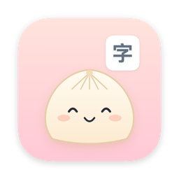
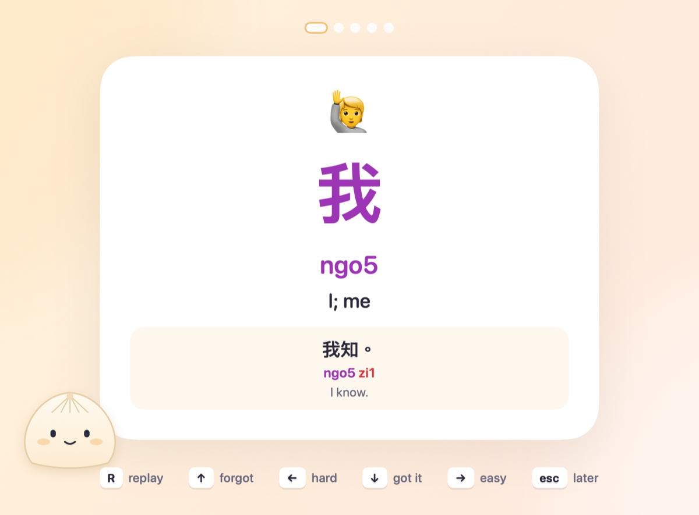
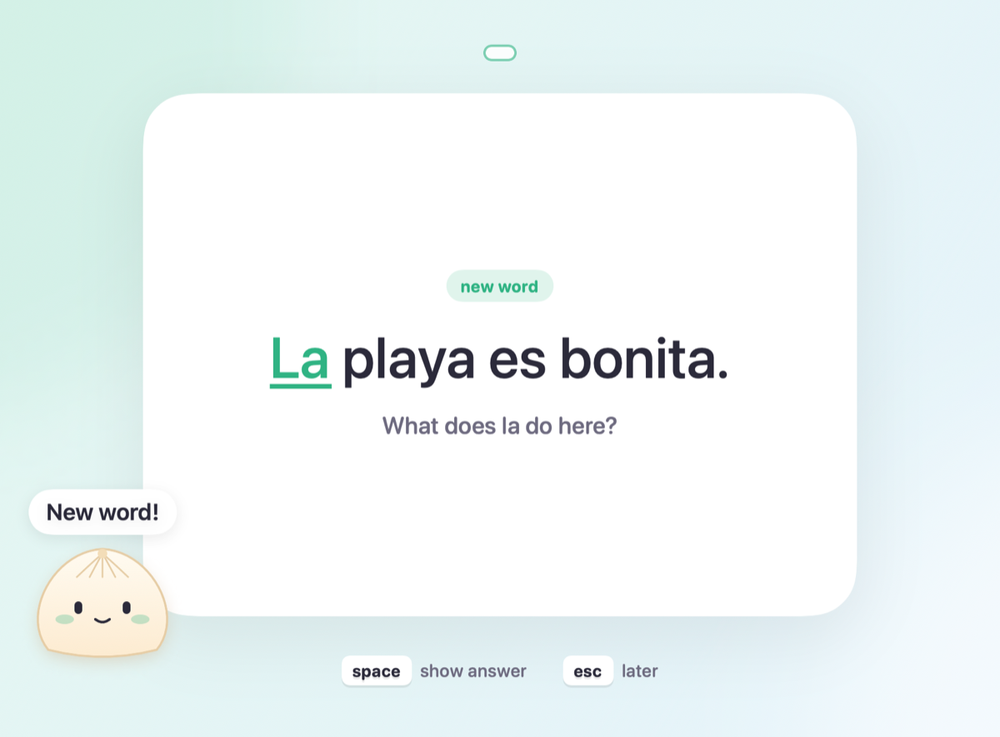
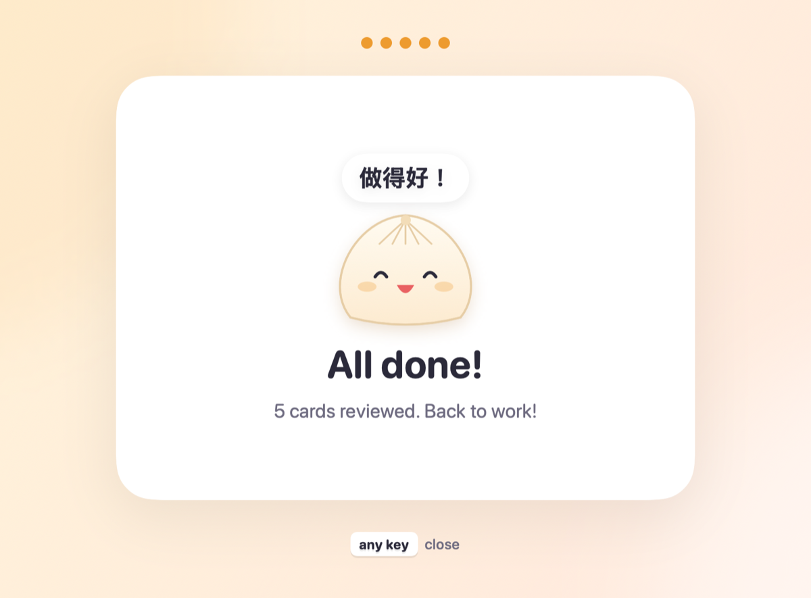
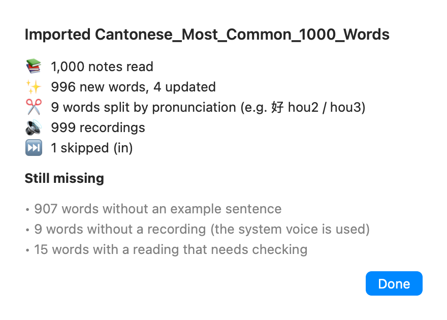
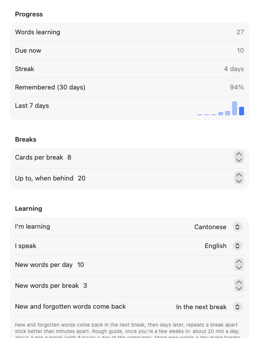

<p align="center">
  
</p>

<h1 align="center">LanguageBreak</h1>

<p align="center">
  Learn a language in the breaks you should be taking anyway.<br>
  <a href="https://github.com/khng/language-break-releases/releases/latest"><b>Download for macOS</b></a> · macOS 26 or later · Apple silicon and Intel · free
</p>

<p align="center">
  
</p>

LanguageBreak is a menu bar app that turns breaks into short, fullscreen flashcard sessions. After an hour of work it takes over the screen for a minute or two of review, then gets out of the way. You bring the words, from an Anki deck or a spreadsheet, and it teaches them most common first, scheduling each review just before you'd forget it.

<p align="center">
  
  
</p>

## Why

Spaced repetition (the method behind Anki) works best in small, frequent doses, but it's easy to never sit down and do your reviews. Break reminders already interrupt you every hour. LanguageBreak puts the two together: the interruption *is* the review, so learning a language becomes a side effect of your workday.

- **Nothing to schedule.** It only counts time you're actually at the computer. It waits for a pause in your typing, stays away while your camera or microphone is in use or a call app is in front, and can pause during a Focus.
- **Nothing to manage.** Add a deck or a word list once. New words come in most common first (10 a day, 3 per break), and each one comes back in the next break before moving on to longer gaps.
- **Made for beginners.** Grammar words (articles, particles) arrive inside a sentence you can already read, not on their own.
- **Any language.** Words, meanings, example sentences and the system voice work for every language. Cantonese also gets Jyutping (how each word is pronounced, in Latin letters), tone colours and a pronunciation dictionary.
- **Private.** No account and no server. Your words and progress stay on your Mac.

At the defaults, once reviews have built up, that's about 20 minutes a day spread over your breaks, and roughly three months to the 1,000 most common words.

## Install

1. Download the `.dmg` from the [latest release](https://github.com/khng/language-break-releases/releases/latest).
2. Open it and drag **LanguageBreak** to Applications.
3. Open it. macOS says it can't verify the developer, because the app isn't notarized by Apple. Click **Done**, then go to **System Settings → Privacy & Security**, scroll down and click **Open Anyway** (it asks for your password). You only do this once.
4. A welcome window helps you choose your language and add words. You can reopen it any time from the menu bar (💬 → **Getting Started…**).

LanguageBreak lives in the menu bar (💬), not the Dock. It doesn't start at login unless you turn on **Start at login** in **Settings → General**. It **updates itself**: once a day it checks for a new version and offers to install it, after checking the update's signature. You can turn this off in **Settings → General**.

## Get some words

LanguageBreak doesn't come with a course: you give it the words you want to learn.

- **An Anki deck (`.apkg`).** Thousands of free decks are on [AnkiWeb](https://ankiweb.net/shared/decks), for example "most common 1,000 words" decks for most languages. Any deck with the word and its meaning works; recordings in the deck are used too.
- **A word list (`.csv` or `.tsv`).** A spreadsheet exported with a header row: the word, its meaning, and ideally a frequency or rank column so the most common words come first. Example sentences and their translations are used if there are columns for them.

  ```csv
  Spanish,English,Frequency,Sentence,Sentence English
  perro,dog,412,El perro come.,The dog eats.
  agua,water,215,Quiero agua.,I want water.
  ```

Add them in **Settings → Words**. Columns are detected automatically; if it isn't sure which column is which, or the list has no frequency column, it shows you its guesses to check first. You can add several sources for the same language: they're merged word by word, so a deck's recordings and a spreadsheet's example sentences end up on the same card.

<p align="center">
  <picture>
    <source media="(prefers-color-scheme: dark)" srcset="docs/import-report-dark.png">
    
  </picture>
</p>

## During a break

Use the keyboard or the mouse: click anywhere to turn the card over, then answer with a key or the buttons under the card.

| Key | Button | |
|---|---|---|
| `Space` | click anywhere, or **show answer** | Show the answer (and hear the word) |
| `↑` | **forgot** | Didn't remember it |
| `←` | **hard** | Got it, but it was hard |
| `↓` | **got it** | Got it |
| `→` | **easy** | Knew it instantly |
| `R` | **replay** | Hear it again |
| `Esc` | **later** | Not now: back in 10 minutes |

A word you forget comes back at the end of the break. When you're done, click anywhere (or press any key) to get back to work. If nothing is due when a break comes round, it's skipped.

From the menu bar (💬) you can also **Review Now**, **Pause for 1 Hour** or **Pause Until Tomorrow** (then **Resume**), and see your progress: words learning, reviews today and your streak. To pause during a Focus: **System Settings → Focus →** (a Focus) **→ Focus filters → Pause LanguageBreak →** turn on *Pause reviews*.

## Settings

<p align="center">
  <picture>
    <source media="(prefers-color-scheme: dark)" srcset="docs/settings-learning-dark.png">
    
  </picture>
</p>

| Tab | What's there |
|---|---|
| **General** | Start at login, how often breaks come (every 60 min of activity), updates |
| **Learning** | Your progress; cards per break; the language you're learning and the one you speak; new words per day and per break; whether new and forgotten words come back in the next break or later in the same one (like Anki); a topic to learn first (needs the Claude or Apple Intelligence helper) |
| **Words** | Your decks and word lists (add, re-import, remove), and the voice used for words without a recording |
| **Helpers** | Optional helpers that fill in what your sources are missing (below) |
| **Backup** | Export, Restore, Reset Progress |

**Voices:** words without a recording use macOS's text-to-speech. The Enhanced and Premium voices sound much better than the default ones: **System Settings → Accessibility → Read & Speak → System voice → Manage Voices…**. Settings → Words shows which voice is in use.


## Helpers (optional)

Sources often have gaps: no example sentence, no reading, no picture. Helpers fill them in for the next words you're about to learn. The app works fully without any of them; whatever a helper adds is marked as generated, and your own sources always win when they disagree.

| Helper | What it adds | Needs | Cost |
|---|---|---|---|
| **Reading dictionary** | Readings for words and sentences (Cantonese) | Nothing: it downloads by itself | Free |
| **Apple Intelligence** | Emoji, topics, which words are grammar words, and pictures (Image Playground) | An Apple silicon Mac with Apple Intelligence turned on | Free, on your Mac |
| **Claude** | Meanings, short beginner example sentences, checks readings; also emoji, topics and grammar words | An [Anthropic API key](https://console.anthropic.com) | About 1 cent per word, filled in once: around $1–3 a month at 10 new words a day |
| **OpenAI** | Pictures, when Image Playground isn't available | An [OpenAI API key](https://platform.openai.com) | Pay per use |

Paste a key in **Settings → Helpers**; it's stored in your macOS Keychain. A Claude Pro/Max or ChatGPT Plus subscription can't be used here: other apps need an API key, which is billed separately.

**What leaves your Mac:** nothing about you, unless you add a key. The app only connects to GitHub, to check for updates and to download the Cantonese dictionary. With a Claude key, the words you're about to learn (with their readings, meanings and example sentences) are sent to Anthropic. With an OpenAI key, a word's short meaning (e.g. "dog") is sent to OpenAI to draw a picture. Your reviews and progress never leave your Mac.

## Backups and moving to a new Mac

Everything you've learned is backed up automatically after every break. **Settings → Backup** can export a copy, restore an earlier state (it saves the current one first, so you can undo), or reset a language to start over.

To move to a new Mac, copy `~/Library/Application Support/LanguageBreak/` across (Migration Assistant does this for you). API keys aren't copied: add them again in Settings → Helpers.

## Uninstall

Quit LanguageBreak from the menu bar, then delete:

- `/Applications/LanguageBreak.app`
- `~/Library/Application Support/LanguageBreak/` (your words, progress, backups and the copies of your sources)
- `~/Library/Preferences/dev.languagebreak.LanguageBreak.plist` (your settings)
- Any API keys: open **Keychain Access**, search for `dev.languagebreak.LanguageBreak` and delete the entries.

## Credits

Scheduling: [FSRS](https://github.com/open-spaced-repetition/swift-fsrs), the spaced-repetition algorithm also used by Anki. Cantonese readings: [rime-cantonese](https://github.com/rime/rime-cantonese) by CanCLID (CC BY 4.0). Reading newer Anki decks: [zstd](https://github.com/facebook/zstd). Updates: [Sparkle](https://sparkle-project.org).
